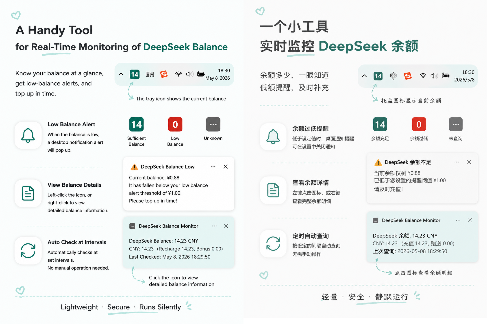
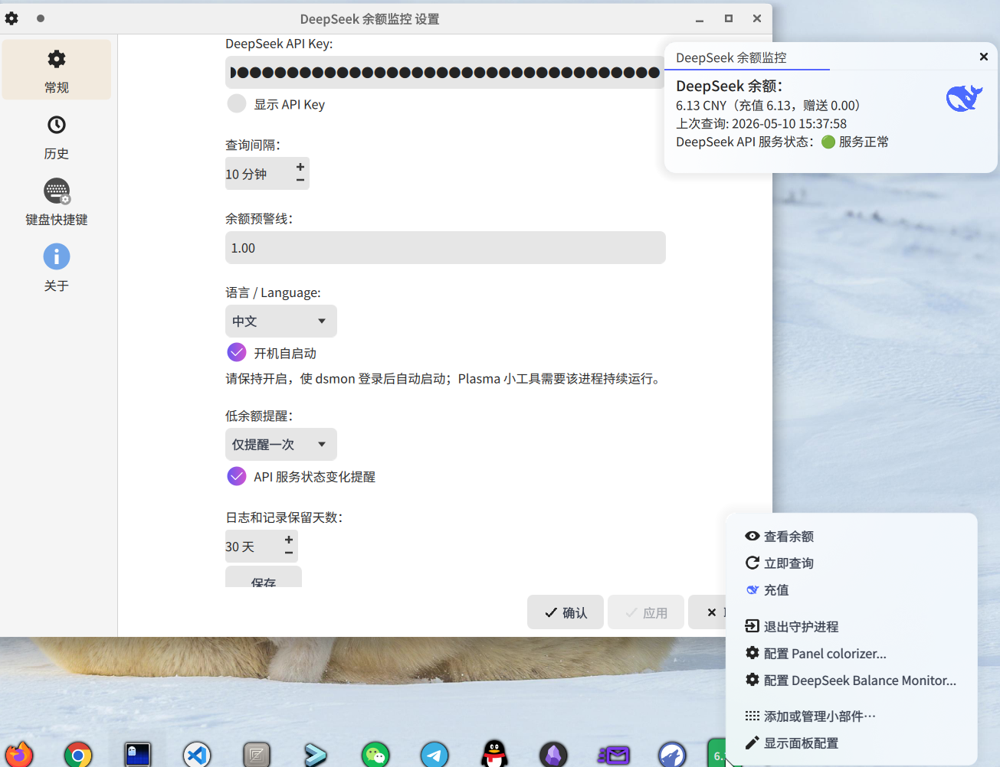

# DeepSeek Balance Monitor

A Windows tray app and Linux CLI/Plasma widget that periodically query the DeepSeek API for account balance and alert on low balance.

[中文版](README_zh.md)



**Linux Plasma widget preview**
The desktop widget is only supported on KDE Plasma 6.



---

## Features

- **Tray icon with balance** — Balance shown as a number on a coloured rounded rectangle. Teal (OK), red (low balance), warm gray (API service degraded), gray (no data yet).
- **Low balance notification** — Three modes in the Python build: never, always, or once per drop (default). The icon turns red regardless.
- **Balance details** — Left-click the Windows tray icon to see balance, API service status, and last check time.
- **Settings** — API key, check interval, alert threshold, alert mode, API status alerts, language, and auto-start on boot.
- **Rust Windows build** — Native Rust build (`rust-windows/`) with Win7/Win8.1 support, bundled icon, and startup-folder auto-start.
- **Rust Linux build** — `dsmon` CLI daemon (`rust-linux/`) with systemd user service support, log retention, and an optional KDE Plasma 6 widget.
- **Balance history** — Rust builds store SQLite balance history, show trend summaries in settings, and export CSV.
- **Plasma widget integration** — The Linux widget reads `dsmon` command output, can start/stop the daemon, and reports command errors through desktop notifications.
- **macOS build** — Community-contributed macOS port (`src/mac/`). Native look-and-feel, Keychain-secured API key storage.

### Notification Previews

**Normal balance view:**

> DeepSeek Balance:  
> 12.34 CNY (Topped 10.00, Granted 2.34)  
> Last Check: 2026-05-08 14:30:00  
> DeepSeek API Status: 🟢 All Systems Operational

**Low balance alert:**

> ⚠ DeepSeek Low Balance  
> Balance is only 0.50, below your alert threshold of 1.00.  
> Please top up!

## Getting Started

### Direct Download

Grab the latest files from [Releases](https://github.com/wenyinos/DeepSeekBalanceMonitor/releases). Use `DeepSeekBalanceMonitor.exe` for the Python-packaged build, `deepseek-balance-monitor.exe` for the Rust Windows build, or `deepseek-balance-monitor-*-linux-x86_64.tar.gz` for Linux. Release builds do not require Python.

### Requirements

- Python build: Windows 10+, Python 3.10+
- Rust Windows build: Windows 7 SP1 / Server 2008 R2 SP1 with all official updates, Windows 8.1 / Server 2012 R2, Windows 10, or Windows 11
- Rust Linux build: RHEL 8 / Ubuntu 20.04 era glibc or newer; KDE Plasma 6.0+ for the optional widget
- macOS build: macOS 10.14+, Python 3.10+

### Windows 7/8.1 Root Certificates

For Windows 7/8.1 systems that cannot query `status.deepseek.com`, run `scripts\update_windows_root_certs.bat` as administrator to update the Windows root certificate store from Windows Update. The script does not bundle certificates and does not change the app TLS backend.

Even after updating root certificates, old Windows systems may still fail to fetch the API service status because DeepSeek's status page uses a different TLS endpoint from the balance API. Common causes include missing TLS 1.2 or Windows Update patches, outdated Schannel cipher support, stale system trust settings, incorrect system time, or HTTPS inspection by a proxy/security product. Balance checks may still work when service-status checks fail. This project treats API service-status checks on Windows 7/8.1 as best-effort and does not plan a program-side workaround.

### Run from Source (Python)

Requires Python 3.10+.

```bash
pip install -r requirements.txt
python main.py
```

### Build from Source

**Python (PyInstaller):**

```bash
pip install pyinstaller
scripts\build_exe.bat
```

Builds `dist\DeepSeekBalanceMonitor.exe`. GitHub Actions auto-builds and attaches the EXE to each release.

**Rust Windows (`rust-windows/`):**

```powershell
cd rust-windows
rustup toolchain install 1.77.2-x86_64-pc-windows-msvc
cargo +1.77.2 build --release --target x86_64-pc-windows-msvc --locked
```

**Rust Linux (`rust-linux/`):**

```bash
cd rust-linux
cargo +1.77.2 build --release --locked
```

Release tarballs install `/usr/local/bin/dsmon`, `/etc/systemd/user/dsmon.service`, and, on Plasma 6 systems, the optional Plasma widget:

```bash
tar -xzf deepseek-balance-monitor-1.1-linux-x86_64.tar.gz
cd deepseek-balance-monitor-1.1-linux-x86_64
sudo ./install.sh
```

Useful Linux CLI commands:

```bash
dsmon init-config
dsmon check
dsmon daemon
dsmon history [days]
dsmon history export [days] [currency|all] [path|-]
dsmon widget-status
```

**macOS (`src/mac/`):**

```bash
cd src/mac
pip install -r requirements.txt
bash ../scripts/build_mac.sh
```

### Python vs Rust

| | Python Windows | Rust Windows | Rust Linux | Python macOS |
|---|---|---|---|---|
| Runtime | Python + pystray + Tkinter | Native Rust + native-windows-gui | Native Rust CLI | Python + rumps + tkinter |
| Min OS | Windows 10+ | Windows 7 SP1+ | RHEL 8 / Ubuntu 20.04 era glibc | macOS 10.14+ |
| First launch (no key) | Opens settings dialog | Opens `config.json` in editor | Prints config path and creates config | Opens settings window |
| Auto-start | Registry Run key | Startup folder shortcut | systemd user service | Login items |
| API key storage | config.json | config.json | config.json | macOS Keychain |

## Project Structure

```
DeepSeekBalance/
├── src/                       # Application package
│   ├── config.py
│   ├── api_client.py
│   ├── icon_renderer.py
│   ├── app_state.py
│   ├── settings_dialog.py
│   └── tray_app.py
├── src/mac/                    # Native MacOS port
│   ├── main.py
│   ├── settings.py
│   └── keystore.py
├── scripts/                    # Build & utility scripts
│   ├── build_exe.bat
│   ├── build_mac.sh
│   ├── setup.bat
│   ├── update_windows_root_certs.bat
│   └── run_silent.vbs
├── rust-windows/               # Native Rust Windows port
│   ├── src/main.rs
│   ├── app.ico
│   ├── app.manifest
│   └── build.rs
├── rust-linux/                # Rust Linux CLI and Plasma 6 widget
│   ├── src/main.rs
│   ├── package/
│   └── plasmoid/
├── main.py
├── requirements.txt
└── README.md
```

## Configuration

Windows builds store settings in `%APPDATA%\DeepSeek Balance Monitor\config.json`:

```json
{
  "api_key": "sk-xxxxxxxx",
  "interval_minutes": 10,
  "threshold_yuan": 1.0,
  "language": "zh",
  "auto_start": false,
  "alert_mode": "once",
  "api_alert_enabled": true,
  "retention_days": 30
}
```

Linux `dsmon` stores settings in `~/.config/deepseek-balance-monitor/config.json` and logs in `~/.local/state/deepseek-balance-monitor/app.log`.

Windows logs are written to `%APPDATA%\DeepSeek Balance Monitor\app.log`.

Rust Windows and Rust Linux store balance history in `balance_history.db` next to their app data. History uses the same `retention_days` setting as log cleanup. The Windows settings dialog and Plasma widget settings include a History tab with days/currency filters, trend summary, chart, and CSV export. Linux CLI output stays English-only and `dsmon history` prints text statistics instead of raw rows.

## Tray Menu

| Action | Trigger |
|---|---|
| View Balance | Left-click the icon, or Right-click → View Balance |
| Check Now | Right-click → Check Now |
| Top Up | Right-click → Top Up |
| Settings | Right-click → Settings |
| Quit | Right-click → Quit |

## Icon Colours

| Colour | Meaning |
|---|---|
| Teal | Balance is above the alert threshold |
| Red | Balance is below threshold, or an API error occurred |
| Warm gray | API service is degraded (balance data may be stale) |
| Gray | First check not yet completed, or no API key configured |

## Changelog

### v1.1

- API service status polling with dedicated icon colour and change notifications
- Three alert modes: never, always, or once per drop (default: once)
- Top-up menu item
- SQLite balance history for Rust Windows and Rust Linux
- History chart, days/currency filters, and CSV export in Rust Windows settings and the Plasma widget
- `dsmon history` summary and `dsmon history export` for Linux CLI
- Plasma widget daemon start/stop action with command-error notifications
- Win7/8.1 root certificate update helper script
- Log & record retention with configurable cleanup
- GitHub Actions auto-build for Python releases
- Community ports: Rust-Win (Win7+), Py-Mac
- Refined notification layout
- Settings input validation
- Removed third-party HTTP dependency (stdlib only)

## License

MIT
