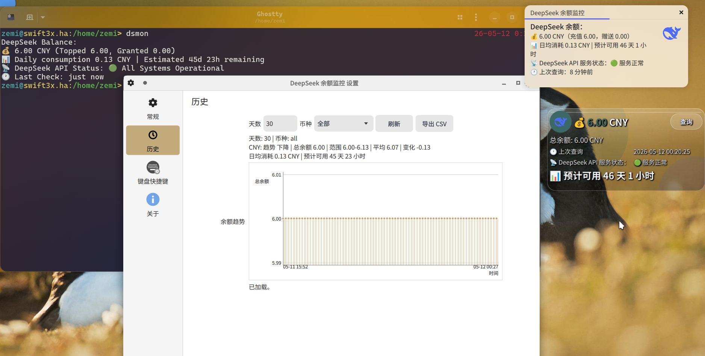

# DeepSeek 余额监控

一个 Windows 系统托盘应用和 Linux 命令行 / Plasma 小组件，定时查询 DeepSeek API 账户余额，并在余额过低时提醒。

[English](README.md)


**Linux Plasma 小组件预览**
桌面小组件仅适用于 KDE Plasma 6 桌面环境。



---

## 功能

- **托盘图标显示余额** — 余额以数字形式显示在任务栏圆角图标上。青色（正常）、红色（低余额）、暖灰色（API 服务异常）、灰色（无数据）。5 套可切换配色 + 自定义 hex 颜色
- **低余额通知** — 三种模式：不提醒、持续提醒、仅提醒一次（默认）。图标仍会变红
- **余额详情** — 左键单击图标查看余额（emoji 前缀）、消耗速率、API 服务状态和相对时间
- **历史记录页** — 分页表格展示所有余额记录，附带折线图和消耗分析，支持 CSV 导出
- **设置** — API Key（Windows 凭据管理器加密存储）、查询间隔、预警阈值、提醒模式、图标主题、代理等
- **Demo 模式** — `--demo` 免 Key 体验，开发者面板可调参数
- **社区移植** — Rust-Win（Win7+）、Rust-Linux（CLI + Plasma 6 小组件）、Py-Mac（Keychain 加密）

### 通知预览

**查看余额：**

> DeepSeek 余额：  
> 💰 12.34 CNY（充值 10.00，赠送 2.34）  
> 📊 日均消耗 1.50  |  预计可用 28 天 4 小时  
> 📡 DeepSeek API 服务状态：🟢 服务正常  
> 🕐 上次查询：5 分钟前

**低余额告警：**

> ⚠ DeepSeek 余额不足  
> 当前余额仅剩 0.50，已低于您设置的提醒阈值 1.00。  
> 请及时充值！

## 开始使用

### 直接下载

从 [Releases](https://github.com/wenyinos/DeepSeekBalanceMonitor/releases) 下载最新文件。Python 打包版使用 `DeepSeekBalanceMonitor.exe`，Rust Windows 版使用 `deepseek-balance-monitor.exe`，Linux 版使用 `deepseek-balance-monitor-*-linux-x86_64.tar.gz`。发布版无需 Python 环境。

### 运行要求

- Python 版：Windows 10+，Python 3.10+
- Rust Windows 版：安装所有官方更新的 Windows 7 SP1 / Server 2008 R2 SP1、Windows 8.1 / Server 2012 R2、Windows 10 或 Windows 11
- Rust Linux 版：RHEL 8 / Ubuntu 20.04 同时代或更新 glibc；可选小组件需要 KDE Plasma 6.0+
- MacOS 版：MacOS 10.14+，Python 3.10+

### Windows 7/8.1 根证书说明

如果 Windows 7/8.1 无法查询 `status.deepseek.com`，可以右键 `scripts\update_windows_root_certs.bat` 并选择“以管理员身份运行”，通过 Windows Update 更新系统根证书库。该脚本不内置证书，也不会修改程序 TLS 后端。

旧版 Windows 即使更新根证书后，仍可能无法获取 API 服务状态，因为 DeepSeek 状态页和余额接口使用不同的 TLS 端点。常见原因包括缺少 TLS 1.2 或 Windows Update 相关补丁、Schannel 密码套件支持过旧、系统信任设置陈旧、系统时间不正确，或代理 / 安全软件进行 HTTPS 检查。余额查询可能仍然正常。项目将 Windows 7/8.1 上的 API 服务状态查询视为尽力而为，不准备在程序侧增加绕过方案。

### 源码运行（Python）

需要 Python 3.10+。

```bash
pip install -r requirements.txt
python main.py
```

### 从源码构建

**Python（PyInstaller）：**

```bash
pip install pyinstaller
scripts\build_exe.bat
```

构建为 `dist\DeepSeekBalanceMonitor.exe`。GitHub Actions 会在每次 Release 时自动构建并上传 EXE。

**Rust Windows（`rust-windows/`）：**

```powershell
cd rust-windows
rustup toolchain install 1.77.2-x86_64-pc-windows-msvc
cargo +1.77.2 build --release --target x86_64-pc-windows-msvc --locked
```

**Rust Linux（`rust-linux/`）：**

```bash
cd rust-linux
cargo +1.77.2 build --release --locked
```

Linux 发布包会安装 `/usr/local/bin/dsmon`、`/etc/systemd/user/dsmon.service`，并在 Plasma 6 环境中安装可选小组件：

```bash
tar -xzf deepseek-balance-monitor-1.1-linux-x86_64.tar.gz
cd deepseek-balance-monitor-1.1-linux-x86_64
sudo ./install.sh
```

常用 Linux CLI 命令：

```bash
dsmon init-config
dsmon check
dsmon daemon
dsmon history [days]
dsmon history export [days] [currency|all] [path|-]
dsmon widget-status
```

**MacOS（`src/mac/`）：**

```bash
cd src/mac
pip install -r requirements.txt
bash ../scripts/build_mac.sh
```

### Python 版与 Rust 版对比

| | Python Windows 版 | Rust Windows 版 | Rust Linux 版 | Python MacOS 版 |
|---|---|---|---|---|
| 运行时 | Python + pystray + Tkinter | 原生 Rust + native-windows-gui | 原生 Rust 命令行 | Python + rumps + webview |
| 最低系统 | Windows 10+ | Windows 7 SP1+ | RHEL 8 / Ubuntu 20.04 同时代 glibc | MacOS 10.14+ |
| 首次无 Key | 弹出设置窗口 | 打开 `config.json` 编辑 | 输出配置路径并创建配置 | 弹出设置窗口 |
| 开机自启 | 注册表 Run 键 | 启动文件夹快捷方式 | systemd 用户服务 | 登录项 |
| API Key 存储 | Windows Credential Manager | config.json | config.json | MacOS Keychain |

## 项目结构

```
DeepSeekBalance/
├── src/                       # 应用主包
│   ├── config.py
│   ├── api_client.py
│   ├── icon_renderer.py
│   ├── app_state.py
│   ├── settings_dialog.py
│   ├── tray_app.py
│   ├── credential_store.py
│   └── storage.py
├── src/mac/                    # 原生 MacOS 移植
│   ├── main.py
│   ├── settings.py
│   └── keystore.py
├── scripts/                    # 构建与工具脚本
│   ├── build_exe.bat
│   ├── build_mac.sh
│   ├── setup.bat
│   ├── update_windows_root_certs.bat
│   ├── run_silent.vbs
│   └── demo.vbs
├── assets/                     # 图标、预览图、字体
│   ├── app.ico
│   ├── AppIcon.icns / .png
│   ├── preview.png / preview_zh.png
│   └── font/
├── rust-windows/              # 原生 Rust Windows 版
│   ├── src/main.rs
│   ├── app.manifest
│   └── build.rs
├── rust-linux/                # Rust Linux 命令行与 Plasma 6 小组件
│   ├── src/main.rs
│   ├── package/
│   └── plasmoid/
├── main.py
├── requirements.txt
└── README.md
```

## 配置

Windows 配置文件路径：`%APPDATA%\DeepSeek Balance Monitor\config.json`

```json
{
  "interval_minutes": 10,
  "threshold_yuan": 1.0,
  "language": "zh",
  "alert_mode": "once",
  "api_alert_enabled": true,
  "retention_days": 30,
  "theme": "default",
  "icon_stroke": false,
  "http_proxy": "",
  "auto_start": false
}
```

API Key 存储在系统凭据管理器（Windows Credential Manager / MacOS Keychain），不写入此文件。

Linux `dsmon` 配置路径：`~/.config/deepseek-balance-monitor/config.json`，日志路径：`~/.local/state/deepseek-balance-monitor/app.log`。

Windows 日志路径：`%APPDATA%\DeepSeek Balance Monitor\app.log`

Rust Windows 和 Rust Linux 会在各自应用数据目录保存 `balance_history.db`。历史记录使用与日志清理相同的 `retention_days` 保留天数。Windows 设置窗口和 Plasma 小组件设置页提供“历史”选项卡，支持天数 / 币种筛选、趋势统计、图表和 CSV 导出。Linux CLI 固定英文输出，`dsmon history` 显示文字统计，不直接展示原始行。

## 托盘菜单

| 操作 | 方式 |
|---|---|
| 查看余额 | 左键单击图标，或右键 → 查看余额 |
| 立即查询 | 右键 → 立即查询 |
| 充值 | 右键 → 充值 |
| 历史记录 | 右键 → 历史记录 |
| 设置 | 右键 → 设置 |
| 退出 | 右键 → 退出 |

## 图标颜色

| 颜色 | 含义 |
|---|---|
| 青色 | 余额高于预警阈值 |
| 红色 | 余额低于阈值，或 API 查询出错 |
| 暖灰 | API 服务异常（余额数据可能已过时） |
| 灰色 | 尚未完成首次查询，或未配置 Key |

配色支持 5 套预设或自定义 hex 值，在设置中切换。

## 更新日志

### v1.1

**新增**

- 接入 `status.deepseek.com` 实时查询 API 服务状态。API 异常时托盘图标显示暖灰色，状态翻转时弹出独立桌面通知
- 托盘右键菜单新增「充值」，一键跳转 DeepSeek 开放平台充值页面
- SQLite 余额历史存储，日志与记录自动清理（默认保留 30 天）
- 社区移植版本：Rust-Win（原生 Rust，Win7+）、Rust-Linux（CLI + Plasma 6 小组件）、Py-Mac（原生 MacOS，Keychain 加密）
  - Rust 版支持历史图表、天数/币种筛选、CSV 导出和 `dsmon history` CLI 命令
  - Plasma 小组件右键可启动/退出守护进程，命令失败时弹出桌面通知
  - Windows 7/8.1 根证书更新辅助脚本

**变更**

- 低余额提醒改为三选一下拉菜单：不提醒 / 持续提醒 / 仅提醒一次，默认仅一次
- 余额详情通知卡片重新设计：标题固定、余额明细内嵌、API 服务状态行常驻
- 设置页保存时校验所有数值输入范围，非法输入弹出明确警告提示

**技术**

- 移除 `requests`，全部改用 Python 标准库 `urllib.request`

### v1.2 (2026-05-11)

**新增**

- 自定义图标样式：5 套预置配色 + 自定义 hex 颜色 + 图标描边开关
- 历史记录页：分页表格 + 折线图 + 消耗速率分析，支持 CSV 导出
- 消耗速率估算：日均消耗与预计可用天数/小时，通知和历史页同步显示
- Demo 模式（`--demo`），可调出开发者面板测试各种状态场景
- HTTP 代理支持
- API Key 加密存入 Windows 凭据管理器，不再写入 config.json

**变更**

- 余额详情通知：emoji 前缀、相对时间、服务状态位置调整
- 设置/历史/开发者面板共享根窗口，历史和开发者面板支持重复唤起聚焦
- 设置页改进：输入校验错误提示、底部版本号与贡献者信息、可点击项目链接
- API 服务状态同步写入本地数据库

## 协议

MIT
