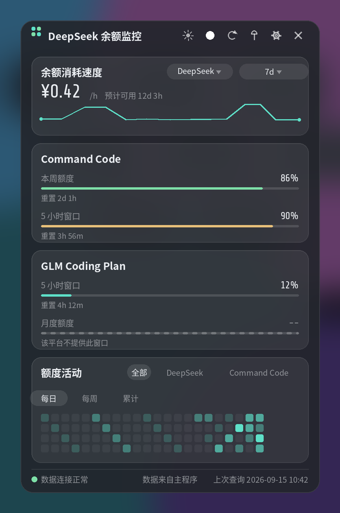
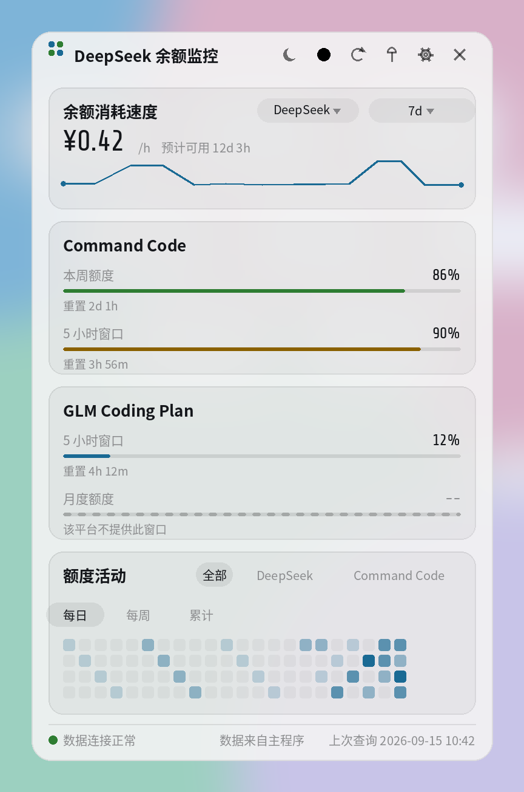
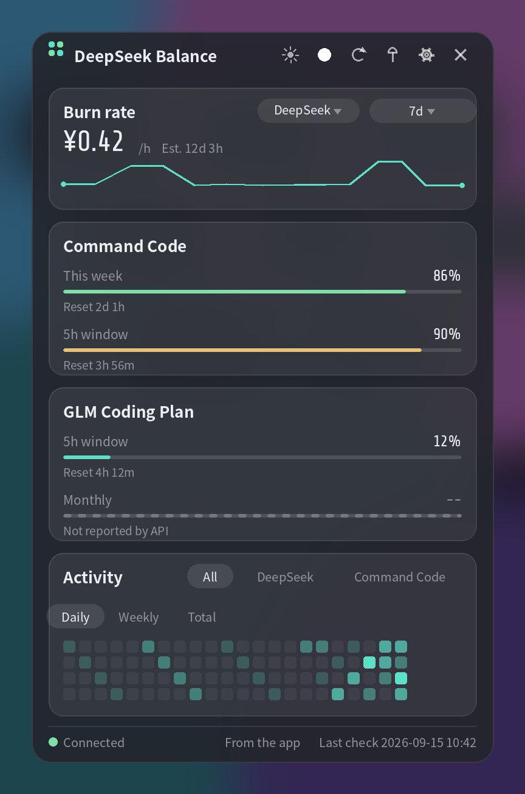
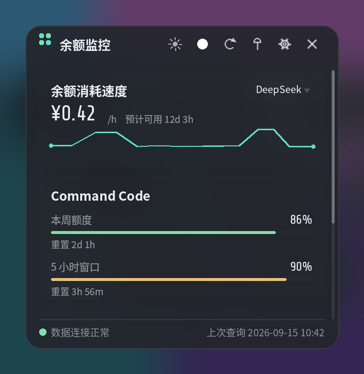
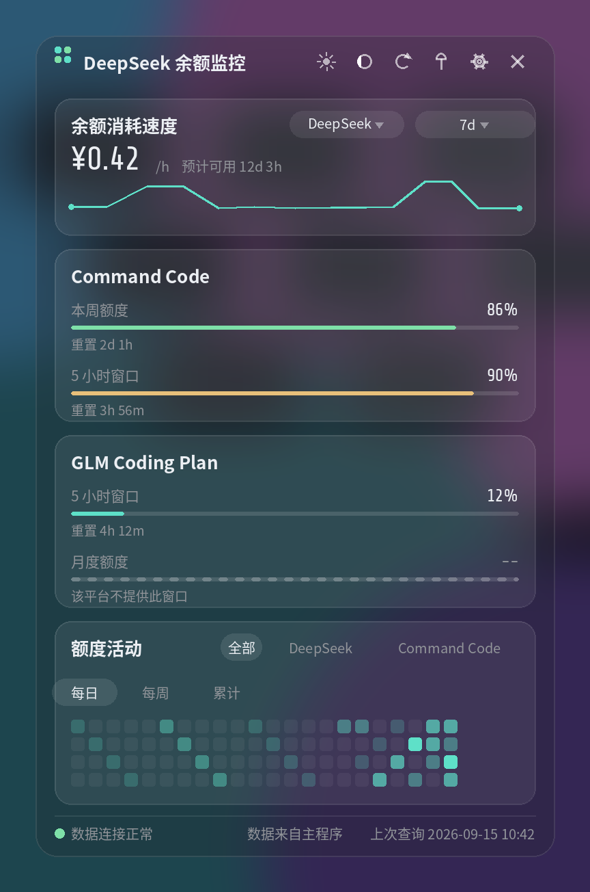
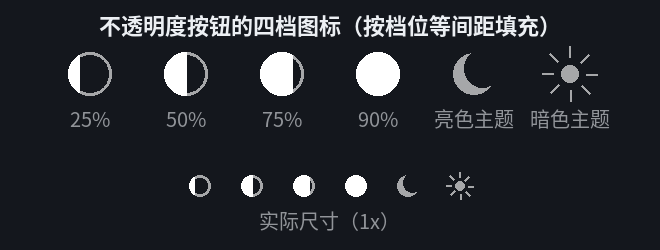
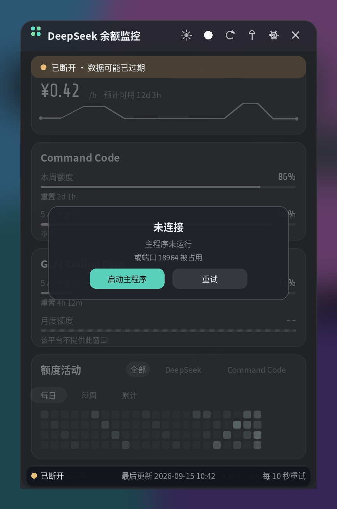

# 桌面小工具：设计与实现

参考图是一块无边框、半透明、置顶的竖排卡片面板：顶部一行速度卡带迷你折线，中间每个套餐一张额度卡
（窗口名 + 百分比 + 进度条 + 重置倒计时），底部一块活动热力图与状态条。本文件说明如何用**本项目现有的
技术栈**（eframe/egui 0.36 + egui_plot 0.37，纯 Rust）做出同风格的桌面小工具。

- **已实现**（2.1 起随主程序发布，可执行文件 `dsmon2-widget`，源码在 `dsmon-ui/src/widget/`）。
  本文件记录设计规则与实现中的取舍，架构结论也已并入 `CLAUDE.md`；改动小工具前先读 §4 与 §7。
- 预览图是**按本方案绘制的设计稿**（不是运行截图），保留它们是为了说明版式与层次；真实界面在
  细节上以 §4 各节的规则为准（一处已知差异：预览图的标题是设计时的「DeepSeek 余额监控」，
  现在是「token 用量」）。
- 术语沿用仓库：`Snapshot`、`PackageQuota`、`QuotaWindow`、`Palette`。

## 布局预览

暗色 · 标准尺寸（380×600，四张卡全部放下）。标题条最左是一键切换明暗的按钮，暗色下显示太阳：



亮色 · 标准尺寸（同一套布局、同一份数据，只换配色）：



**英文** · 标准尺寸（中英并排做过对照：每处文案的宽度都按中文对齐挑过词，两种语言的版式与卡片高度
完全一致，不会因为切换语言而重排）：



暗色 · 紧凑尺寸（320×330，内容放不下，右侧出现滚动条；头部与底部状态条固定不动）：



**不透明度 25% 档**：标题条第 2 个按钮**不写数字**，档位由圆的填充程度表示（默认档是"满"，见上面的标准
预览图），点一下循环一档。这张图是循环到 **25%** 后的样子——按钮变成左侧一条细填充，同时整块面板明显透出
桌面，而数字与进度条依然清晰：



四档图标本身能否分辨（上面一行 2x、下面一行实际尺寸 1x）——右侧两个是主题按钮的图标，用来核对不撞脸：



**断开状态**（主程序没在运行）：旧数据保留但整体灰显，顶部一条横幅说明断开时长，中间一张提示卡给出
「启动主程序 / 重试」，页脚改为断开状态并显示下次重试倒计时：



---

## 1. 结论摘要

| 项 | 决定 |
|---|---|
| 形态 | 独立可执行文件 **`dsmon2-widget`**，无边框 + 半透明 + 可置顶的小窗口 |
| **数据来源** | **一律从主程序取**（本地 HTTP，`127.0.0.1:18964`）。小工具**不查任何平台 API、不写数据库** |
| 主程序没在跑 | 提示卡（未连接 + 启动主程序 + 重试）+ **每 10 秒自动重连**；旧数据保留并灰显 |
| 界面代码位置 | `dsmon-ui` crate 的第三个 binary（`src/bin/dsmon2-widget.rs` + `src/widget/`），界面仍只有一份 |
| 新增依赖 | **0 个**。`eframe`/`egui`/`egui_plot` 已够；本地 HTTP 用 `std::net` 手写最小实现 |
| 显示内容 | **只有平台余额与订阅额度**。token 计数明确不做（§3.2） |
| 显示范围 | **只显示已配置的平台**（有 API Key 的）；未配置的不出现（§4.6） |
| 尺寸 | 预设标准 / 紧凑两档 + **窗口可自由拖拽缩放**；放不下时右侧出滚动条（§4.1） |
| 外观 | egui 半透明窗口（面板 + 卡片两层透明度），**不做系统级模糊**（§3.3）；**不透明度四档
25/50/75/90**，标题条一键调（§4.11） |
| 主题 | **亮色与暗色都要**：跟随 `ui_theme`，标题条一键切换，两套半透明配色（§4.7） |
| **语言** | **中英都要，且跟随主程序**（`ui_language`），小工具不做独立开关，2 秒内同步（§4.8） |
| 接口何时在 | **常开**：主程序在跑就监听（仅回环、只读、不含密钥），进程退出即消失 |
| `widget_enabled` | 只表示「主程序启动时是否拉起小工具」+ 托盘菜单勾选；不控制端口（§3.4） |

---

## 2. 现状盘点

**已经有的（白捡的）**

- `AppConfig` 里 **widget 六个字段已存在**并有 clamp 与单测：`widget_enabled`、`widget_size`
  （`compact`/`standard`）、`widget_opacity`（默认 0.9，上限 1.0）、`widget_always_on_top`（默认 true）、
  `widget_show_trend`（默认 true）、`widget_pos`（`config.rs:76-86`）。**目前界面无一处使用**，只在
  `config.rs` 测试与 `adopt.rs` 的「这是本版 config.json」判据里出现——本方案正好把它们用起来。
- 1.x 的现成先例：本地回环接口 `/widget-status`、`/check`，以及
  `rainmeter-widget/PYTHON_RAINMETER_INTEGRATION.md`（随 `9fc023a` 删除）。**Python 版接入的契约形状
  已经定过一次**，本方案沿用同一形状，不另发明。
- 界面资产可复用：`theme::Palette`（6 套配色 × 明暗）、`fonts::DIGITS_FAMILY`（内嵌 ShareTech 数字，
  预览图里的 ¥0.42 就是它）、`views::{card, progress_line, usage_color, status_color, status_dot}`、
  `dsmon_core::platforms::format_reset_seconds`、i18n 表与覆盖率测试。
- 主程序侧数据齐备：`Snapshot`（`packages`、`consumption_rates`、`service_status`、`last_check`、
  `checking`、`balances`）、`storage::{history_records, subscription_usage_history}`、
  `history::daily_usage`。
- 「哪些平台已配置」现成：`app.rs::configured_platforms()`（`storage::read_secret(key)` 有值即已配置）。

**缺的**

- 主程序没有任何本地接口——本方案要新写（§3.4）。
- 小工具本身不存在（`src/widget/` 与第三个 binary 都要新写）。
- 热力图需要的历史聚合目前只在主程序内存里，接口要把它算好再给（§3.4 载荷）。

### 2.1 必须**先修**的缺陷：配置文件不是原子写

`AppConfig::save()` 是 `std::fs::write(path, text)` **直接覆盖**，而 `AppConfig::load()` 在解析失败时会把
配置文件**改名为 `config.json.corrupt` 并返回默认值**（见 `config.rs`）。

以前只有一个进程，撞不上；**引入第二个进程后这条路径就会毁数据**：小工具正好在主程序写盘的瞬间读取，
就会解析到半截 JSON → 把用户的配置改名 → 两个进程各按默认值运行并各自写盘 → 主题、间隔、阈值、
图标配色、窗口位置全部丢失，只在磁盘上留一个 `.corrupt` 文件。

修法（Phase 1 第 1 步，先于一切）：

1. `save()` 改为**写同目录临时文件 + `fs::rename`**（同文件系统内 rename 是原子的），失败时清理临时
   文件。读者要么看到旧内容、要么看到新内容，永远不会看到半截。
2. `load()` 保留现有抢救逻辑（改名留证据），原子化之后它只会在用户手工改坏文件时触发。
3. 加测试：`save()` 之后目录里没有残留临时文件，且 `load()` 能读回等值配置。

---

## 3. 架构决策

### 3.1 小工具是纯消费者，不再自己轮询

小工具**不启动 `Monitor`、不查 API、不写数据库、也不读密钥文件**（密钥只用主程序进程内解密，小工具从头到尾拿到的都只是数字），只做一件事：从主程序的本地接口取快照然后渲染。

| | 现在（拍板） | 原方案（已废弃） |
|---|---|---|
| 数据获取 | 主程序提供 `127.0.0.1:18964`，小工具每 2 秒取一次 | 小工具自带 `Monitor`，自己查 API |
| 双轮询 | 不存在 | 两进程同时跑时 API 请求翻倍 |
| 未启动主程序 | 明确提示 + 自动重连 | 自己也能出数据（但那是另一套 API 用量） |
| Python 版 | 实现同一份契约即可，小工具一行不改 | 需要一个 Python 侧的适配层 |

这也让「小工具要不要写历史、要不要发通知」这类问题一并消失：**它只读**。

### 3.2 只做余额与订阅额度，不做 token 计数

界面只认两种读数，没有第三种：

| 读数 | 来源 | 呈现 |
|---|---|---|
| **金额** | `payg` 平台的 `Balances` / `ConsumptionRate` | 余额卡（**每个已配置平台一张**）：余额 + `¥0.42/h`（`hourly_rate`）+ `预计可用 12d 3h`（`busy_hours_left`）+ 折线 |
| **百分比** | `package` 平台的 `QuotaWindow.usage_percent` + `reset_in_sec` | 额度卡：窗口名 + 百分比 + 进度条 + 重置倒计时 |

**两个口径必须照抄主程序，不许自创**：

- **速率固定 7 天窗口**。主程序在轮询线程里用
  `history::consumption_rate_with_fallback(platform, retention_days, interval_minutes)` 算好放进
  `Snapshot.consumption_rates`——7 天，没数据则回退到保留窗口。小工具**直接显示这个数字**，不按界面上的
  范围重算，否则同一时刻两个窗口会给出不同的"日均消耗"。
- **时间范围只属于折线图**。主程序历史页的范围是 `views::history::RANGES = [1, 7, 30]` 天（标签 `1d/7d/30d`，
  默认 7）。小工具的范围下拉复用同一个常量、同一个标签写法，**只切换折线**，不动速率数字。
- 为什么不能有小时级窗口：余额按 `interval_minutes` 采点（默认 10 分钟），用户还能把它调到 30–1440 分钟；
  1 小时窗口在默认间隔下只有约 6 个点，间隔调大后只有 0–1 个点，而 `consumption_rate_from_records` 会丢弃
  空闲段与平坦段——结果不是「数据不足」就是噪声。
- 数字旁边的两行文案同样复用主程序：`daily_rate`（日均消耗）、`estimated_remaining`（预计可用）、
  `not_enough_data`（数据不足，无法计算），排版工具是 `views/status.rs` 里的 `format_busy_hours`（语言中性，
  如 `12d 3h`）。

界面上没有任何「token」字样，也没有「本周期消耗」这类项目里并不存在的读数。将来若要加 token 口径，只需在
契约里多一种读数与单位后缀，卡片布局不变。

### 3.3 外观：半透明即可，不做系统级模糊

egui/eframe 能把窗口做成 ARGB 透明（`.with_transparent(true)` + `App::clear_color` 返回全透明），但
**不会也不能模糊窗口背后的桌面**——模糊是合成器的活。Linux 侧没有跨桌面环境的统一做法（KWin 认 X11
属性、Hyprland/picom 各配各的、GNOME 对普通应用窗口不提供），Windows 侧虽可用 Acrylic/Mica，但会造成
两端观感不一致。因此：**只做半透明分层**（面板 + 卡片两层不同透明度的表面色 + 1px 高光描边 + 圆角），
不引入任何模糊相关依赖。透明窗口依赖合成器；拿不到合成器时把底色画成不透明，避免黑块。

### 3.4 数据接口：固定端口，常开，只读

- **监听 `127.0.0.1:18964`**（1.x 占的是 17654，本版另起一个，避开两版并存的冲突）。固定端口，不做
  备选段、不写端口文件。绑定失败时**写日志并在接口不可用状态继续运行**；小工具的提示文案要写明
  「主程序未运行，或端口 18964 被占用」，让用户能自己判断。
- **常开**：主程序在跑就监听，不做动态启停（省掉一套监听生命周期管理）。仅回环、只读、不含密钥，
  主程序退出即消失。
- **`widget_enabled` 只管拉起**：主程序启动时是否顺手拉起小工具、托盘菜单里是否勾选。一个已有字段，
  零新增配置。
- **两个端点**（沿用 1.x 形状）：
  - `GET /widget-status?days=7` → 当前快照（只读）。`days` 取 `1 | 7 | 30`（默认 7），**只影响折线数据**，
    不影响速率
  - `GET /check` → 触发一次轮询，**立即返回当前快照**（不等待查询完成）
- 响应头 `Content-Type: application/json; charset=utf-8`、`Cache-Control: no-store`、
  `Connection: close`；其他路径 404，非 GET 405。
- **实现零依赖**：服务端 `std::net::TcpListener`，客户端 `std::net::TcpStream`，都在
  `dsmon-core/src/widget_api.rs` 里，手写最小 HTTP（只认请求行）。**不能用 `reqwest` 发这个请求**——
  它会走系统/环境变量代理，把发往回环的请求也代理出去（项目自己就有 `proxy_*` 配置）；手写 TcpStream
  没有这个坑。读请求时设 `set_read_timeout`，避免半开连接把监听线程卡住。
- **安全**（三条，缺一不可）：①**只绑回环** `127.0.0.1`，不监听任何外部地址；②**不传凭据**——载荷里
  没有任何 API Key、密文或密钥材料，客户端也不需要提供任何凭据；③**不做鉴权**，不设令牌：这是本机单用户
  工具，接口只读且不含凭据，加一层令牌既挡不住本机用户（他本来就能读状态目录），又会让第二个实现多出
  一套必须对齐的东西。

载荷（`version` 用于日后协商，未识别的主版本要在界面上说人话）：

```json
{
  "version": 2,
  "provider": { "name": "dsmon2", "version": "2.1.1" },
  "generated_at": "2026-09-15 10:42:00",
  "lang": "zh",
  "checking": false,
  "service_status": "none",
  "last_check_sec": 42,
  "platforms": [{
    "key": "command_code", "display": "Command Code", "kind": "package",
    "balances": [{ "currency": "CNY", "total": 12.34 }],
    "rate": { "hourly_rate": 0.42, "busy_hours_left": 291.5, "currency": "CNY" },
    "windows": [
      { "name_key": "window_5h",     "usage_percent": 12.0, "reset_in_sec": 7200 },
      { "name_key": "window_weekly", "usage_percent": 86.0, "reset_in_sec": 86400 }
    ],
    "series": [{ "t": 1757900000, "v": 0.31 }],
    "daily": [{ "date": "2026-09-14", "used": 3.2 }]
  }]
}
```

结构约定：

- `platforms` **只含已配置平台**（筛选在主程序侧做，规则与侧边栏一致——见 §4.6）。
- `windows[].name_key` 是 i18n 键，由小工具翻译（不返回已本地化的成品文案，界面文案只有一处来源）。
- **`rate` 就是 `ConsumptionRate` 原样**（`hourly_rate` + `busy_hours_left`，**7 天口径**，由主程序的轮询
  线程算好）；小工具只负责单位格式化与文案，不重算（§3.2）。
- **`series` 是余额曲线**，与历史页同源（`storage::history_records`），点值 `{t, v}` 是时间戳与该时刻总余额；
  由 `days` 决定窗口，**服务端降采样到 ≤240 点**（30 天 × 10 分钟 = 4320 点，原样发出会让每 2 秒一次的
  轮询背上 ~90KB 的载荷，而绘图根本用不到那么多点）。
- `daily` 只给热力图用的数字（`history::daily_usage` 的结果），**按平台各来一份**；热力图要的
  「全部订阅合计」由客户端把几份按日期相加（§4.4），服务端不另算一份。
- `lang` 是主程序当前语言，**给小工具之外的消费者参考**（例如第三方客户端）；小工具自己从
  `config.json` 读语言，不依赖这个字段（§4.8）。

### 3.5 断开状态

| 状态 | 行为 |
|---|---|
| 连上 | 每 **2 秒** GET `/widget-status`，拿到就重绘 |
| 断开 | 每 **10 秒**重试（同一条循环，只改间隔），页脚显示「10 秒后重试」 |
| 断开时的画面 | 最后一次成功的数据**保留但整体灰显**，顶部横幅「已断开 · 数据可能已过期」，中间提示卡「未连接 / 主程序未运行 / 或端口 18964 被占用」+ 「启动主程序」「重试」两个按钮 |
| 恢复 | 一旦 GET 成功立刻回到连接态：横幅消失、颜色恢复，不需要用户操作 |

「启动主程序」按钮：按 `std::env::current_exe()` 的同级目录找 `dsmon2`（Windows 为 `dsmon2.exe`）并
`spawn`；找不到就退化为提示「未找到主程序，请手动启动」。主程序是单实例，已在运行时点了也只会立刻
退出，不会开出第二个窗口。

---

## 4. 视觉规范

### 4.1 窗口

```rust
ViewportBuilder::default()
    .with_title("…")
    .with_decorations(false)
    .with_transparent(true)              // App::clear_color 返回 [0.0, 0.0, 0.0, 0.0]
    .with_always_on_top()                // 取 config.widget_always_on_top，运行时用 WindowLevel 切换
    .with_taskbar(false)                 // 仅 Windows：不进任务栏与 Alt-Tab
    .with_resizable(true)
    .with_inner_size(size)
    .with_min_inner_size([280.0, 240.0])
    .with_position(pos)                  // config.widget_pos，逻辑点
```

- **尺寸**：`widget_size` 只作**启动预设**——`standard` = 380×600、`compact` = 320×330，它定的是**宽度**；
  高度由用户拖出来并写回 `widget_window_size`，之后启动以它为准（§4.10 有交互定义）。**宽度锁死**：
  一列卡片加宽没有意义，加高才有。
- **滚动**：内容放不下时右侧出现细滚动条（宽 5px、圆角、半透明）；**顶部标题条与底部状态条固定**，
  只有中间卡片区滚动（预览图 3 就是这个状态）。放得下时滚动条不显示、不占宽度。
- **拖动与改尺寸**（`window_handles`）：**左、右、下三条边各一条 8pt 宽的带子**负责移动窗口
  （`drag_started()` → `ViewportCommand::StartDrag`）；**下方左右两个角各一块 18pt 见方的热区**负责改高度
  （`drag_started()` → `ViewportCommand::BeginResize(SouthWest / SouthEast)`）。角比带宽、且后注册，所以
  两者重叠处归角。**标题条两者都不参与**：拖拽区压在六个按钮下面会把点击吞掉，实测按钮会集体失效
  （§7 有这条陷阱的完整来龙去脉）。位置与尺寸在稳定后写回 `widget_pos` / `widget_window_size`（逻辑点，
  不除 `pixels_per_point`）。
- **改尺寸必须走 `BeginResize`**：无边框窗口在 X11 下没有窗口管理器画出来的边框，`with_resizable(true)`
  只是允许**程序**改尺寸——光靠"能拖"是改不了的（这条是踩出来的：先前的实现只有三条移动带，高度根本
  变不了）。`BeginResize` 之后由窗口管理器接着拖，指针跟手。
- **位置兜底**：恢复 `widget_pos` 时若该坐标不在任何显示器范围内（显示器拔了、分辨率变了），丢弃该值
  并居中到主显示器——否则窗口会在屏幕外，用户完全看不到。
- **窄宽度退化**（宽度 < 340px，即紧凑尺寸及用户把它拖窄以后）：按「先不重叠、不截断，再谈信息量」的
  顺序舍掉次要项——页脚省略中间的「数据来自主程序」，只留左侧连接状态与右侧时间（两项并排会撞在一起）；
  速度卡省略范围下拉，折线保持默认 7d；额度行省略「重置」标签，只留时长。这些取舍在紧凑尺寸的预览图里
  就是这个样子。
- **圆角与阴影**：圆角自绘（`CornerRadius::same(16)`）；窗口投影无 API，用 1px 亮色描边把面板与桌面分开。

### 4.2 卡片

同一套结构、两套配色（值取自 `theme.rs` 的 `Surfaces::DARK` / `LIGHT` 与 `Default` 强调色，全部经
`theme::Palette` 取用，不写死）：

| 属性 | 暗色 | 亮色 |
|---|---|---|
| 面板表面 | `bg_panel`（#363636）按 `widget_opacity`（默认 0.9）合成 alpha，圆角 16 | `bg_panel`（#ffffff）同规则 |
| 面板描边 | 白 13% | 黑 8% |
| 卡片表面 | 白 7.5% 叠在面板之上，圆角 12 | 黑 4.5% 叠在面板之上 |
| 卡片描边 | 白 10% | 黑 8% |
| 进度条底轨 | 白 13% | 黑 10% |
| 主文字 / 次要文字 | `text_primary`（白）／其 55% | `text_primary`（黑）／#4a4a4a 档 |
| 强调色 | accent #5ee0c8 / positive #7ee0a8 / warning #e8c07a | accent #1a6a94 / positive #2e7d32 / warning #8a6100 |
| 卡片间距 / 内边距 | 8px / 12px | 同 |
| 标题 / 大数字 | 13px 粗体；余额 20px、速率 16px `DIGITS_FAMILY` + 10.5px 单位 | 同 |

**每个已配置的余额平台各一张卡**（`cards::balance_card`），标题就是平台名——与额度卡同一条规矩：面板
只显示第一个平台，会把主程序正在轮询的其它账户悄悄藏起来。卡里两个数字，**余额在上、速率在下**：
`余额 32.70 CNY` 是主数字（20px，比速率那行大），下面一行 `0.42 /h CNY 预计可用 12d 3h` 是它的派生物
（16px + 10px 说明）。余额带 `balance_word` 标签，免得和速率混淆——两个都带货币单位时，光看数字分不出
哪个是存量、哪个是流量。没有消耗历史的平台（例如刚配置的 Kimi）只显示余额与折线，速率那行换成
`not_enough_data`；折线范围是**所有卡片共用一个设置**，所以那颗 `7d` 按钮只长在第一张卡上。

**额度卡里一个窗口两行**（不是三行）：`窗口名 …… 重置 3h 56m 86%` 一行，进度条一行。重置信息是百分比
的脚注，跟它并排比单独占一行省下三分之一高度——同一屏因此能多放一张卡（这是「一屏尽量多内容」的
具体做法）。

> 预览图的面板色偏冷（贴近参考图），实际取值以 `theme::Palette` 为准：暗色 `bg_panel` 是中性灰
> #363636，亮色是纯白 #ffffff。布局、层次与不透明度规则与预览图一致，只有色相不同。

### 4.3 进度条与虚线

复用 `views::progress_line`（3px 圆头）+ `views::usage_color`（≥60% 琥珀、≥80% 红）。窗口无读数时画虚线：

- 有读数：实心条 + 右侧百分比。
- 无读数（平台不提供该窗口）：**灰色虚线** + 右侧 `--` + 一行说明（「该平台不提供此窗口」）。

虚线不是装饰，它把「未提供」与「用了 0%」区分开。**未配置的平台整张卡都不显示**（§4.6）。

### 4.4 折线与热力图

- 折线：`egui_plot::Plot`，关掉坐标轴/网格/交互，高 34–44px，1.7px 描边 `palette.accent`，不填充。
  数据来自契约里的 `series`，**是余额曲线**（与历史页同一份数据、同一套口径），不是速率曲线。
- **范围只作用于折线**：第一张余额卡右上角的范围按钮取 `1d / 7d / 30d`（与历史页 `RANGES` 同一个常量、同一种
  标签写法，默认 `7d`），切换时带 `?days=` 重新取数；卡片上的 `¥0.42/h` 与 `预计可用 12d 3h` 始终是
  7 天口径，**不随范围变化**。
- 热力图：自绘——12 列（周）× 7 行（周一…周日）圆角方格，颜色按「当天消耗 ÷ 窗口内最大单日消耗」
  分 4 档（≥75% / ≥50% / ≥25% / 其余）。数据来自契约里的 `daily`，**每个平台一份**。
- **活动卡在最后**（`cards::activity_card`，排在所有订阅卡之后），一次显示一张网格：标题右侧是一排
  **标签**（`全部` + 各订阅），选中的那个填成 accent 色、字取对比色，点击即切换，**默认停在「全部」**
  ——同时订几家的用户最先想知道的是「今天一共用了多少」。每个订阅各有一张自己的网格，标签是把它们
  逐个调出来的入口（不做同时并排：订阅一多，竖排会占掉整屏）。
- **标签只用一个词**：取平台显示名的第一个词（`Command Code` → `Command`、`GLM Coding Plan` → `GLM`），
  全名放在 hover 提示里。多个订阅要共用一行，全名会把彼此挤下去（`horizontal_wrapped` 只负责换行，
  换得太勤就不是"一排标签"了）。中文名同理取首个词。
- **每张网格按自己的最大值分档**，不跨订阅共用比例尺：同一时刻只有一张在屏幕上，共用比例尺会让用量
  小的订阅看起来一片空白，而那不是它的样子。
- 「全部」是**客户端求和**（`merged_days`，按 `date` 相加各平台的 `daily`），契约不用改，Python 版照做
  即可。选中的订阅若已不在已配置列表里（密钥被删），自动退回「全部」。

### 4.5 头部与底部

- 头部（固定）：小 logo + 标题 + 六个图标按钮。无边框窗口没有系统按钮，这六个是唯一入口，从左到右：

| # | 图标 | 功能 | 点击后写什么 | 断开时 |
|---|---|---|---|---|
| 1 | ☀（暗色下）/ ☾（亮色下） | 明暗切换：`theme::toggled` → `set_mode` 立即生效 | `ui_theme` 写回配置 | 可用（本地配置） |
| 2 | 按档位填充的圆（¼ · ½ · ¾ · 满） | 不透明度：**点一下循环**一档 25 → 50 → 75 → 90 → 25；**没有菜单，也不显示数字** | `widget_opacity` 写回配置 | 可用（本地窗口属性） |
| 3 | ⟳ | 刷新：GET `/check`，让主程序立刻查一次 API，2 秒内看到新数 | 不写配置 | **置灰禁用**（没有主程序可调） |
| 4 | 📌 | 置顶开关：`ViewportCommand::WindowLevel` 在 `AlwaysOnTop` / `Normal` 之间切 | `widget_always_on_top` 写回配置 | 可用（本地窗口属性） |
| 5 | ⚙ | 设置：唤出主程序窗口；**主程序没在跑就顺手拉起它**（与断开提示卡上的「启动主程序」同一条路径，复用 `instance.rs` 的 `Show` 机制） | 不写配置 | 可用（等价于启动主程序） |
| 6 | ✕ | 关闭：退出小工具进程 | `widget_enabled = false` | 可用 |

- **标题条本身不响应任何交互**（`Sense::hover()`）：拖动改由左/右/下三条边负责（§4.1）。这不是
  风格选择——拖拽区与按钮重叠过，代价是六个按钮集体失效。
- **置顶要有按下态**：无边框窗口看不出开没开，📌 处于置顶时用 accent 色高亮；其余按钮用普通次要色。
- **刷新要有进行态**：契约里的 `checking` 为真时 ⟳ 一并置灰，避免连点。
- **按钮的全部状态**：正常色 / 悬停（`bg_hover`）/ 按下（accent 高亮）/ 禁用（次要色再降透明度）。
- **tooltip**：六个按钮各一条，其中「刷新」直接复用主程序现成的 `check_now`（「立即查询」/「Check
  Now」），其余五个新增（`widget_tip_theme`、`widget_tip_opacity`、`widget_tip_on_top`、
  `widget_tip_settings`、`widget_tip_close`）——设置那条要写明是「打开主程序设置」，因为小工具自己没有
  设置页；不透明度那条只写「不透明度」/「Opacity」，**不带数值**：档位由图标本身表示，带上数值就得拼
  字符串，会破坏「文案全是静态键」这条纪律。日后若确实需要精确值，可在 tooltip 里补一个百分比，代价是
  这一处要破例拼数字。
- **按钮宽度**：六个图标按钮各 26px、间距 2px，整排 166px，加上左边距 14px 与 logo 21px 共 201px。
  标准宽度 380px 下标题还剩 151px（「DeepSeek 余额监控」约 110px，宽松），紧凑宽度 320px 下剩 91px
  （「余额监控」约 52px，够）。**再加第七个按钮就要先处理标题**（截断或改成只显示图标）。
- 底部（固定）：`● 数据连接正常`（`status_dot` + 语义色）、`数据来自主程序`、复用 `last_check`
  （「上次查询」/「Last check」）+ `time::format_local` 的绝对时间；断开时换成
  「已断开 / 最后更新 <时间> / 每 10 秒重试」。
- **不用相对时间**（「3 分钟前」）：`i18n.rs` 是静态表、不支持插值，主程序状态页用的也是绝对时间；
  跟着它走，小工具的新文案就全是静态键（§4.8）。

### 4.6 显示哪些平台

**只显示已配置的平台**，两端规则一致（主程序筛选、小工具只管渲染）：

- `payg` 平台：有 Key 的才有一张余额卡（顺序按 `catalog::PLATFORMS`）；没有 Key 的一个都不列——这是
  契约里 `platforms` 已经筛过的，小工具不再自己判断（§3.4）。
- `package` 平台：有 Key 的才出一张额度卡，顺序按 `catalog::PLATFORMS`。
- 密钥存在但 `PlatformMeta.implemented == false`：也不显示（与主程序侧边栏规则一致）。
- 一个平台都没配置时（`platforms` 为空数组），卡片区显示一张提示卡：「还没有配置平台，去设置里填 API
  Key」+ 一个打开主程序设置页的按钮，而不是留一块空白面板。

预览图里只有 DeepSeek / Command Code / GLM 三个平台，正是这个规则的结果。

### 4.7 亮色与暗色

一套机制、两个入口、跨进程同步：

- **机制**：直接用主程序那套，不另造配色——`theme::install(ctx, Style::from_config(&config.theme),
  &config.icon_colors)` + `theme::set_mode(ctx, theme::mode_from_config(&config.ui_theme))`。
  6 套风格 × 明暗共 12 种组合，界面代码里**一个颜色都不写死**。
- **配置**：`ui_theme` ∈ {`system`, `light`, `dark`}；`system` 时跟随桌面深浅色。
- **入口**：标题条最左的按钮与主程序左下角那个按钮实现一致——`theme::toggled(ctx.theme())` 取反 →
  `theme::set_mode` → `theme::mode_to_config` 写回 `config.ui_theme` 并保存。切一次就持久。
- **同步**：小工具本来就每 2 秒取数，顺手**重读 `AppConfig::load()`**（原子写之后安全），比对
  `ui_theme`、`theme`、`icon_colors`、`ui_language`（§4.8）与 `widget_opacity`（§4.11）、`widget_always_on_top`、
  `widget_show_trend`、`widget_size`，有变化才应用／重设窗口。**主题、语言与外观都必须同步**，否则主程序
  设置页改了不透明度或语言，小工具不跟随。间隔类字段（`interval_minutes`）不同步：数据节奏由主程序决定。
- **对比度**：亮色下虚线、次要文字、底轨都要在白色面板上看得清。`theme.rs` 已有 WCAG 相对亮度的
  对比度测试，新增的半透明色值要按同一规则加测试。
- **兜底**：拿不到合成器时画不透明底色（§3.3），亮色即纯白面板、暗色即纯灰面板。

### 4.8 中英本地化

- **语言只有一处来源**：主程序的 `ui_language`（`config.json`）。小工具**不设独立语言开关**——主程序
  设置页里改一次，两个界面一起变；断开时也能正确渲染，因为语言是从本地配置读的，不依赖连接。
- **同步**：与主题同一条路径——每 2 秒重读配置，`ui_language` 变了就换语言并重绘。
- **共用一张文案表**：小工具与主程序用同一个 `i18n.rs`、同一个 `tr(lang, key)`；新增键必须中英同时加，
  `every_key_the_interface_uses_is_answered` 会拦。
- **契约只给键、不给成品文案**：`windows[].name_key` 是 `window_5h` / `window_weekly` /
  `window_monthly` 这类 i18n 键（主程序侧用现成的 `catalog::window_label_key` 生成），由小工具翻译——
  界面文案只有一处来源，也不会出现「主程序是英文、小工具是中文」的错位。
- **时间用语言中性的写法**：`format_reset_seconds` 本来就返回 `3h 56m` 这种中性串（主程序也这么用），
  小工具不加「后重置」这类后缀，而是前面挂一个静态标签键 `reset_label`（「重置」/「Reset」，两种语言
  词序一致）。相对时间（「3 分钟前」）**不做**：`i18n.rs` 是静态表、不支持插值，而主程序状态页用的也是
  绝对时间（`time::format_local`）。照此办理，**小工具新增的文案全部是静态键、零插值**。
- **能复用的一律复用**：速率的两行直接调 `daily_rate`（「日均消耗」/「Avg」）、`estimated_remaining`
  （「预计可用」/「Est.」）、`not_enough_data`（「数据不足，无法计算」），页脚用 `last_check`，刷新按钮的
  tooltip 用 `check_now`（「立即查询」/「Check Now」）；范围标签沿用历史页的 `1d/7d/30d` 写法（语言中性，
  不新增键）。真正要新增的只有卡片标题、`reset_label`、`provider_note`、活动卡片标题与页签、页脚
  「数据来自主程序」、断开状态那一组，以及另外五个按钮的 tooltip。
- **英文按与中文等宽选词**：CJK 一个字约等于两个拉丁字母的宽度，因此英文一律取短词——
  `余额消耗速度`→`Burn rate`、`本周额度`→`This week`、`5 小时窗口`→`5h window`、
  `该平台不提供此窗口`→`Not reported by API`、`数据连接正常`→`Connected`。目的是**切换语言不改变版式**：
  卡片高度、进度条位置、页脚三分栏都不动（两张预览图逐项对齐过）。
- **换行兜底**：卡片高度用固定值，避免某一种语言换行后把版式撑开（与主程序 `SUMMARY_CARD_HEIGHT`
  的做法一致）。

### 4.9 断开状态（视觉）

- **横幅**：紧贴头部下方的一条琥珀色条（warning 色 + 近乎不透明的底），左侧一个 warning 圆点，
  文案「已断开 · 数据可能已过期」（静态键，不带时长）。它盖住其下的内容，不与卡片文字互相干扰。
- **提示卡**：卡片区正中一张近乎不透明的卡，「未连接」标题（13px 粗体）、两行说明（主程序未运行 /
  或端口被占用）、两个按钮——主程序按钮用 accent 实底（文字颜色按填充亮度取黑或白，沿用
  `theme.rs` 里既有的规则），重试按钮用底轨色。
- **灰显**：断开前的内容保留，整体降饱和到 12%、亮度 85%、再与面板色混合 50%。数字仍可辨读，但一眼
  能看出是过期数据。

### 4.10 尺寸预设与自由缩放的交互

- **宽度是固定的，只有高度归用户**：面板是一列卡片，加宽只会把它们拉长；加高才省滚动，而订阅配置得
  越多这一点越要紧。改高度的入口是**下方两个角**（§4.1）；`lock_width()` 每帧比对一次，宽度偏了就发
  `ViewportCommand::InnerSize([预设宽, 当前高])`——宽度被拉回、高度原样保留。实测：请求 700×900 得到
  475×900（380 逻辑点 @125%）。拖角时窗口管理器会连宽度一起改，所以那一下会看到宽度弹回，这是预期的。
- 启动：`widget_window_size` 有值就用它（宽度仍会按上面的规则校正），没有则用 `widget_size` 预设。
- 用户拖高窗口 → 防抖 700ms 后写回 `widget_window_size`（宽度就是锁定值；不写 `widget_size`）。
- 设置页里改 `widget_size` 预设 → 换的是**宽度**（`standard` 380 / `compact` 320），高度保持用户拖出来的
  值，下次启动也如此。

---

### 4.11 不透明度四档

标题条第二个按钮**点一下循环一档**，**只改面板底色的 alpha**。按钮上**不写数字**，档位由圆的填充
程度表示：

| 档位 | 取值 | 按钮图标 | 观感 |
|---|---|---|---|
| 25% | 0.25 | 圆内左侧 ¼ 填充 | 几乎全透，桌面内容主导；适合壁纸干净的位置 |
| 50% | 0.50 | ½ 填充（即经典的 ◐） | 半透 |
| 75% | 0.75 | ¾ 填充 | 偏实，仍能看见桌面 |
| 90% | 0.90 | 满（实心圆） | **默认**；沿用原来的默认值，不引入 100% 这一档 |

规则：

- **档位就是取值域**：`config.rs` 新增 `WIDGET_OPACITY_LEVELS = [0.25, 0.50, 0.75, 0.90]`（挨着已有的
  `WIDGET_SIZES`），`normalize()` 把 `widget_opacity` 夹取到 `[0.25, 0.90]` 后**吸附到最近的档位**
  （距离相同取较低档）。这样界面、配置、文档三处永远只有四种状态，按钮的填充程度不会与实际取值对不上。
- **默认值不动**：`default_widget_opacity()` 保持 **0.9**——它正好是最高档，所以**老配置里的 0.9 不受影响**；
  只有中间的散值（例如手改出来的 0.6、0.8）会被吸到最近的档位。
- **`MIN_WIDGET_OPACITY` 从 0.5 改到 0.25、`MAX_WIDGET_OPACITY` 从 1.0 改到 0.90**（让常量与档位一致；
  现在是 0.5，直接写 25% 会被夹回去）。既有的夹取逻辑与它的单测要一起改。
- **只降面板，不降内容**：卡片底色、进度条、文字的不透明度不跟着变——25% 时桌面透得更多，但数字仍然
  清晰。**不要**把文字也一起变淡，那会直接破坏 §4.7 那套对比度底线。
- **无合成器时按不透明绘制**：拿不到合成器就照 §3.3 画满不透明底色，但**不改配置里的档位值**——那只
  是绘制时的兜底，用户选的 25% 仍然留在配置里，换个有合成器的会话就恢复。
- **交互：点击循环，没有菜单**。按 25 → 50 → 75 → 90 → 25 的顺序走一档，每点一次立刻生效并写回配置
  （配置是原子写的，见 §2，所以小工具自己写这一项不会和主程序打架）。**不做弹出菜单，也不在按钮上写
  数字**——用户不必点开就知道现在是第几档，点的瞬间整块面板的透明度就变了，那才是最直接的反馈。
- **图标按「第几档」等间距填充，不是按百分比填充**：四档画成 ¼、½、¾、满。配置里的取值是
  0.25 / 0.50 / 0.75 / 0.90，但**图标画的是档位序号而不是数值**——90% 画成"满"，因为 0.75 与 0.90 在
  14px 的图标上差不到 1px，按数值画的话后两档根本分不出来。**别照着数值去"修正"填充比例。**
- **按钮外观**：13px 图标、26px 宽，与其它五个按钮等宽等距，颜色用次要色；悬停有 `bg_hover` 底，点击闪
  一下按下态。填充部分要**裁在圆内**（圆盘与矩形的交集），不能直接画方块。
- **与主题按钮不冲突**：主题按钮在亮色下是新月（缺口形）、暗色下是太阳（带光芒），与本按钮的"弦形填充 +
  圆环"在 1x 下都能分开（暗色下最满那档是实心圆，靠太阳的光芒区分）。四档图标与这两个主题图标的对照见
  `../assets/preview_widget_opacity_icons.png`。

### 4.12 小工具自己的托盘与图标

- **小工具有自己的托盘**（`widget/tray.rs`，Linux ksni / Windows tray-icon），与主程序那一个并存：菜单是
  「隐藏/显示桌面小工具」（复用 `widget_menu_show` / `widget_menu_hide`）、分隔线、「启动主程序」
  （复用 `widget_start_app`）、「退出」（复用 `quit`）——**没有新文案**。左键点击 = 显示/隐藏，
  与菜单第一项同一个动作；Linux 侧单击即 `activate`，Windows 侧是 `with_menu_on_left_click(false)`
  加一个左键事件处理。
- **显示/隐藏走 `ViewportCommand::Visible`**，状态记在 `Widget::visible` 里，菜单文案由它决定。这套必须
  放在 `logic`：窗口不在屏幕上时不会绘制，写在 `ui` 里的处理永远不会被执行——菜单就再也唤不回面板了
  （坑与主程序托盘完全一样，见 §7）。
- **图标是"同一只鲸鱼 + 强调色角标"**（`dsmon_core::icon::widget_icon`）：主程序与小工具的图标会同时出现
  在托盘、任务栏或 Alt-Tab 里，两个一模一样的标记等于让用户自己猜。角标取默认主题的 accent
  （#5ee0c8），画在右下角、留 4% 边距、占 44% 见方——小到 16px 也还看得见。**窗口图标与托盘图标是同一
  张**（都走 `widget_icon`），用户说的「应用图标和托盘图标相同」就是这个意思：小工具内部一致，对外与
  主程序不同。
- **不进任务栏**：Linux 用 X11 的窗口类型 `Utility`（egui 的 `with_window_type(X11WindowType::Utility)`，
  对应 `_NET_WM_WINDOW_TYPE_UTILITY`）——规范里它就是"小型的常驻工具窗口"，窗口管理器会把它排除在
  任务栏与窗口列表之外；Windows 用 `with_taskbar(false)`。两边的窗口图标仍然带着角标，所以即便某个
  桌面坚持把它列出来，也认得出是哪一个。
- 托盘图标与文字都随语言变化：`follow_config()` 发现 `ui_language` 变了就 `tray.set_language()`。
- **小工具有自己的开机自启项**（`widget_auto_start`，默认开）：与主程序那条**互相独立**，所以小工具
  可以单独随会话启动——那时主程序还没跑，它就显示断开提示并每 10 秒重连。两次对账：启动时按配置写入
  或移除，**关闭时（✕）一并移除**（关闭就是不再需要，留着条目下次登录又会把它带回来）。路径与主程序
  同一套约定，只是文件/值名带 `-widget` 后缀、**不带 `--minimized`**（它没有窗口要收起来），见
  `INTERFACES.md` §5。
- **Windows 的托盘注册要自己问**：`tray-icon` 对 `Shell_NotifyIconW(NIM_ADD)` 失败**不报错**，所以
  `Tray::report()`（每帧调用，只在答案变化时写一行日志）用 `TrayIcon::rect()` 反查系统是否真的持有
  图标——`Shell_NotifyIconGetRect` 只对系统持有的图标给出矩形。这与主程序是同一个坑（见 §7 与
  `AGENTS.md`），只是小工具不需要据此改变行为：托盘没成功，面板自己的 ✕ 照样能关它。
- **两边都要能编过才算同步**：小工具的平台代码一半在 `#[cfg(windows)]` 里，而 CI 只在 push/PR 时编
  Windows（`windows.yml`）。本地 `cargo fmt` 能发现那半边代码的**语法**错误（rustfmt 会解析 cfg 掉的
  模块），但**类型与名称错误它看不到**——`use std::sync::Arc` 少了这一句就是人工审读才揪出来的
  （2026-09-15）。改动涉及 Windows 分支时，push 一次让 CI 编过再算数。

---

## 5. 代码落地结构

```
dsmon-core/
  src/widget_api.rs            # 新：服务端（TcpListener + 最小 HTTP）与客户端（TcpStream GET）
                               #     + 契约结构体（serde）+ 从 Snapshot/历史组装载荷       ~320 行
  src/config.rs                # 改：① save() 原子化（tmp + rename）② 新增 WIDGET_OPACITY_LEVELS
                               #     四档常量 [0.25,0.5,0.75,0.9]、MIN 0.5→0.25、MAX 1.0→0.90、
                               #     normalize() 吸附到最近档位（默认值 0.9 不变），补/改单测   ~35 行
  src/catalog.rs               # 改：把 configured_platforms() 从 dsmon-ui/app.rs 挪进来，
                               #     暴露为 catalog::configured()——侧边栏与接口共用一条判据  ~20 行
  src/monitor.rs               # 改：给 widget_api 提供读快照与历史聚合的入口（series/daily） ~30 行

dsmon-ui/
  src/bin/dsmon2-widget.rs     # 新：13 行，调 dsmon_ui::widget::run()
  src/widget/
    mod.rs                     # 窗口、生命周期、拖动/缩放/位置记忆、标题条六按钮与自绘图标、
                               #   页脚、跟随主程序的配置                                    ~470 行
    client.rs                  # 每 2 秒取数 / 断开 10 秒重试 / 启动主程序                     ~130 行
    cards.rs                   # 玻璃卡片、速度卡、额度卡、活动卡（聚合热力图 + 范围胶囊）、
                               #   断开提示卡、空态、按钮；聚合在 merged_days 里做          ~360 行
    charts.rs                  # 余额曲线（自绘折线）与活动热力图（自绘 12×7 网格）          ~140 行
    tray.rs                    # 小工具自己的托盘（图标带角标、菜单三项、显示/隐藏）      ~230 行
                               # 复用现成的 views::{progress_line, usage_color} 与 theme，不重复实现
  src/instance.rs              # 改：把 D-Bus 名 / 互斥体名参数化，给小工具一份自己的名字    ~30 行
  src/views/status.rs          # 改：format_busy_hours 提为 pub(crate)（或挪到共用处），
                               #     小工具与状态页共用同一个「12d 3h」排版               ~10 行
  examples/widget_preview.rs   # 开发时启动小工具（与 preview 同一角色，不走平台入口）        ~12 行
```

- 与主程序共享 `theme`、`fonts`、`i18n`、`dsmon_core::*`；**不改** `storage.rs` 的表结构、**不改**
  `views/` 的现有页面。
- **小工具自己的单实例**（已实现）：Linux
  `com.github.wenyinos.deepseek-balance-monitor-widget`、Windows `Local\DeepSeekBalanceMonitorWidget`
  与事件 `…WidgetShow`。`instance.rs` 的 `Names` 结构把两套名字并排放着，`claim()` 只多收一个名字参数；
  D-Bus 的 **interface 名两边共用一个**（调用方指定服务名，interface 名只在单个进程内解析），
  所以 `ShowRequest` 只有一份。第二个实例把已有窗口唤到前面：小工具收到 `Request::Show` 后
  `Visible(true)` + `Focus`，主程序收到则走 `show_window()`。**绝不占用主程序的名字**——那会让
  小工具被判为 `Latecomer` 直接退出，反过来也会让主程序在小工具开着时启动不了。
- **小工具只 append 日志**（`storage::log_line`），**不做任何裁剪**：`prune_logs` 与历史裁剪都是
  「读全文 → 覆盖写」，两个进程同时做会互相覆盖。

---

## 6. 分阶段实施与验收

### Phase 1：主程序侧（先把数据端做出来，此时还没有界面）

1. **配置原子写**（§2.1）：`save()` 改 tmp + rename + 失败清理。
   验收：`cargo test -p dsmon-core config`；手工确认 `~/.config/dsmon2/` 下无残留 `.tmp`。
2. **契约结构体**：`widget_api::Payload` 等 serde 类型，字段全部 `#[serde(default)]`，不明字段忽略。
   验收：往返测试（序列化→反序列化等值）；缺字段的 JSON 能解析成默认值而不是报错。
3. **服务端**：绑定 `127.0.0.1:18964`，实现 `/widget-status` 与 `/check`，未知路径 404、非 GET 405。
   验收：`curl -s 127.0.0.1:18964/widget-status | python3 -m json.tool` 字段齐全；
   `curl -s 127.0.0.1:18964/check` 立即返回且主程序开始轮询（看日志）；占用端口时主程序仍正常启动
   （只是接口不可用）并留下日志。
4. **载荷组装**：已配置平台筛选、`rate`（直接取 `Snapshot::consumption_rates`，7 天口径）、
   `series`（按 `?days=1|7|30` 取 `storage::history_records` 并降采样到 ≤240 点）、`daily`、
   `last_check_sec`、`service_status`。
   验收：只配一个平台时 `platforms` 只有一个元素；未配置平台不出现；`days=30` 时 `series` 不超过 240 点、
   `days` 非法时按 7 处理；`rate` 的数字与主窗口状态页显示的**完全一致**。
5. 质量门：`cargo fmt --all --check && cargo test --workspace --locked`。

### Phase 2：小工具

1. **窗口骨架**：新 binary + `run()`，透明/无边框/置顶/拖动/缩放/位置记忆/自己的单实例。
   验收：`cargo run -p dsmon-ui --example widget_preview` 与三张预览图逐项比对；拖动与缩放后重启
   位置尺寸不变；主程序关闭时小工具窗口不消失。
2. **状态与数据**：`client.rs`（2 秒取 / 断开 10 秒重试）+ `state.rs`（视图模型）。
   验收：先开小工具再开主程序，10 秒内自动连上；杀掉主程序，横幅出现且旧数据灰显。
3. **卡片与图表**：速度卡、额度卡、虚线行、活动卡（聚合热力图）、空态。
   验收：有 ≥2 天历史时热力图有分级；只有 1 个数据点时显示占位而不是空白；同时配两家订阅时，
   热力图默认是两家之和，点胶囊可切到单家再切回「全部」。
4. **断开状态**：横幅、提示卡、两个按钮、灰显、自动重连（对照第 4 张预览图）。
   验收：「启动主程序」能拉起主程序并自动恢复；主程序已在跑时点它不会开出第二个窗口。
5. **主题与外观**：接 `theme::install` + `theme::set_mode`（标题条第 1 个按钮）、不透明度循环按钮
   （标题条第 2 个按钮，§4.11）、跨进程同步；补对比度测试。
   验收：明暗切换即时生效、重启保持；不透明度连点五次循环一整圈回到起点（25→50→75→90→25），
   每点一次面板透明度与按钮填充同步变化、重启后档位保持；把按钮截图放大到 1x 后四档仍能分辨
   （对照 `assets/preview_widget_opacity_icons.png`）；25% 下桌面明显透出而数字仍清晰；主程序里改主题或
   不透明度，小工具在 2 秒内跟随（反向亦然）。
6. **中英本地化**：新文案全部进 `i18n.rs`（中英同时加）；契约的 `name_key` 经 `catalog::window_label_key`
   + `tr()` 翻译；时间用 `format_reset_seconds` 的中性串 + `reset_label` 前缀；页脚复用现成的
   `last_check`（「上次查询」/「Last check」），不另造同义键。
   验收：主程序里把语言切成 English，小工具 2 秒内跟着变；中英两张标准预览图逐项比对，版式与卡片高度
   完全一致；`cargo fmt --all --check && cargo test --workspace --locked`（含 i18n 覆盖率测试）。
7. **测试**：`WidgetData` 一律是纯函数（契约进、视图模型出），单测覆盖筛选、单位、空态、灰显；契约解析
   测试只喂 JSON 字符串，**不碰任何路径**。注意 `test_support::state_in_a_scratch_directory()` 是
   `#[cfg(test)]` 且**私有于 `dsmon-core`**，`dsmon-ui` 的测试根本调不到它——所以这里只能靠「不落盘」
   来满足那条铁律（它的由来是一次真实的丢数据事故）。若将来确有必要在 `dsmon-ui` 里碰路径，先在那边
   做一个等价的临时目录守卫。

### Phase 3：接入与发布（已完成）

- **托盘菜单**加一项，菜单文案即动作：`widget_menu_show`「显示桌面小工具」/ `widget_menu_hide`
  「隐藏桌面小工具」，随 `widget_enabled` 互换（`tray::widget_label`）。**不用勾选项**：ksni 0.3 的
  公开 API 里没有带勾选的菜单项（`StandardItem` 只有 label/enabled/visible/icon/shortcut/disposition），
  与其两端文案各异，不如两边都写动作。
- **谁拉起谁**：主程序启动时按 `widget_enabled` 启动 `dsmon2-widget`（与自己同目录，`widget::start_process()`）；
  勾选时同样。取消勾选**不去杀进程**——小工具每帧重读配置，发现 `true → false` 就自己
  `ViewportCommand::Close`（`follow_config`），只有「变了」才算，手动启动（配置本是 false）不受影响。
  小工具自己的关闭按钮反过来写 `widget_enabled = false`，主程序每 2 秒把该字段读回来对齐菜单文案。
- **单独发布二进制包**：`packaging/build-packages.sh` 一次产出四个包——主程序与小工具各一份 deb/rpm。
  小工具二进制只要在主程序二进制旁边就会被包进去（`${binary%/*}/dsmon2-widget`），没有就跳过并说一声。
  两个包各带自己的 `.desktop` 与**自己名字的图标文件**：同一路径被两个包声明是格式级冲突。
  Windows 侧：**各出各的 MSI**（`packaging/windows/product.wxs` 与 `widget.wxs`，两个 UpgradeCode、
  两个「应用和功能」条目，可分别安装/升级/卸载），但**装进同一个目录** `Program Files\DeepSeek Balance Monitor`
  ——两个 exe 必须在一起，否则谁也叫不起谁；先装哪个都行。两个 MSI 与两个 exe 各走一次签名请求
  （SignPath 一次只认一个文件，混在一起就分不清签的是哪个），并各带 SHA256。
  构建路径不变：`cargo build --release -p dsmon-ui --bin dsmon2 --bin dsmon2-widget`。
- CI 与 `CODE_SIGNING.md`（同目录）同步：Windows 的两个 exe 都要签名（小工具单独一次签名请求，
  免得 SignPath 的应答里分不清哪个文件被签了）。
- 验收：`packaging/build-packages.sh 2.0.2 amd64 target/release/dsmon2 dist` 在真机上产出了
  `deepseek-balance-monitor-2.0.2-1.x86_64.rpm` 与 `deepseek-balance-monitor-widget-2.0.2-1.x86_64.rpm`，
  后者只含 `/usr/bin/dsmon2-widget`、自己的 `.desktop` 与四档图标；只装这个包时小工具能连上主程序
  并渲染（主程序仍是必需的供数方）。deb 的 control 字段与文件布局在本机按同样模板核对过（本机无
  `dpkg-deb`，由 CI 的容器实产）。

### Phase 4：Python 版接入

- 契约已经写进 `INTERFACES.md`（同目录）的「本地数据接口」一节，端点、载荷、错误码、版本协商与
  「只绑回环」的红线都在那里。Python 版照做即可，**小工具一行不改**。
- 版本协商：小工具遇到无法识别的主版本时，在断开提示卡上加一行「主程序版本过新，请升级小工具」，
  而不是装作连不上。
- 验收：写一个几行的 Python 桩（`http.server` + 固定 JSON）返回样例载荷，小工具渲染正常——这条验收
  不需要真的有 Python 版，只要有第二个人按契约供数就行。

---

## 7. 跨平台注意与陷阱

- **Linux 必须走 X11/XWayland**：无边框 + 置顶 + 拖动依赖 X11；原生 Wayland 下 `with_always_on_top`
  与 `StartDrag` 是空实现。小工具同样要调 `app.rs::prefer_x11`，文档写明同一句限制。
- **透明需要合成器**：拿不到合成器时把底色画成不透明（§3.3），两种主题都适用。
- **Windows**：`with_taskbar(false)` 不进任务栏；`with_active(false)` 可避免显示时抢焦点。托盘相关的
  编号陷阱与本工具无关（它没有托盘）。
- **`instance.rs` 是共用件**：参数化名字时不要改动主程序的名字与语义，否则单实例保护会失效。
  两边共用同一个 D-Bus **interface** 名是刻意的（`#[zbus::interface(name = …)]` 只接受编译期常量，
  而服务名已经把两个进程分开了）；`Request` 与 `tray::Command` 是两个队列，别把它们并成一个——
  小工具没有托盘，托盘命令对它没有意义。
- **两个程序互找靠"同一个目录"**：`dsmon2` 与 `dsmon2-widget` 由 `current_exe()` 的父目录拼名
  （`widget::client::spawn_sibling`）。开发时 `cargo run --example …` 的目录里没有对方，按钮点了会失败
  并写日志——这是预期行为，不是 bug；两个发布包里它们始终在一起。
- **ksni 没有勾选菜单项**（0.3.6）：`StandardItem` 只有 label/enabled/visible/icon/shortcut/disposition，
  带 toggle 的 `RawMenuItem`、`ItemType`、`ToggleType` 都是 crate 私有。所以那一项只能靠**文案**表达状态，
  两端才一致。
- **打包时两个包不能声明同一个路径**：`/usr/share/icons/.../apps/<名字>.png` 与 `.desktop` 都必须各带各的
  名字（`if [ -x … ]` 那段的 `package_files()` 里一一列出），否则 rpm 直接报文件冲突。
  另外 `build-packages.sh` 的打包函数用位置参数 `$1..$5` 分工、不定义局部变量：它跑在容器里的 `sh`
  下，`local` 不在 POSIX 里。
- **代理**：本地取数**绝不能走 `reqwest`**（会受 `proxy_*`/环境变量影响把回环请求代理出去），
  用 `std::net::TcpStream` 手写（§3.4）。
- **DPI 与多显示器**：位置/尺寸一律以逻辑点存取；恢复位置时做范围兜底（§4.1）。
- **`ViewportInfo` 里的矩形已经是逻辑点**（egui 全程用点，`pixels_per_point` 只用于光栅化）：写回尺寸时
  再除一次缩放是错的。这个错误实测让"380×600"被存成"304×480"，**每启动一次窗口就缩一圈**，直到撞上最小
  尺寸。判断窗口尺寸是否正确时也别被物理像素骗了——125% 缩放下 380×600 的窗口在 `xwininfo` 里是
  475×750。
- **重绘节奏**：连上时每 2 秒取数、断开时每 10 秒重试——由数据到达驱动重绘，**不要**做 60fps 空转，
  置顶常驻窗口的耗电都在这儿。
- **文案测试与本地化**：新文案中英同时加，`every_key_the_interface_uses_is_answered` 会拦；英文按与中文
  等宽选词，别让切换语言改变版式（§4.8）。本轮新增的键：窗口标题、速度卡标题、`reset_label`、
  `provider_note`、活动卡片标题与两组页签、页脚三处（连接正常 / 数据来自主程序 / 复用 `last_check`）、
  断开状态的横幅与提示卡（标题、两行说明、两个按钮）与页脚三处（已断开 / 最后更新 / 每 10 秒重试），
  以及另外五个按钮的 tooltip（刷新那条复用 `check_now`，见 §4.5）。
- **窗口名用键、不用成品文案**：契约给 `name_key`（`window_5h` 等），小工具经 `catalog::window_label_key`
  取键再 `tr()` 翻译——这是「文案只有一处来源」的具体做法，也避免主程序与界面语言不一致。
- **档位要写进配置的夹取规则里**：`widget_opacity` 的 25% 档需要先把 `MIN_WIDGET_OPACITY` 从 0.5 降到
  0.25（`MAX` 同时从 1.0 降到 0.90 与最高档对齐），否则小工具写回的 0.25 会被 `normalize()` 立刻夹回
  0.5——界面看着能点，实际存不下。加了新档位就同步改 `config.rs` 的三处常量、吸附规则与单测（本仓库的
  风格是这类夹取都有测试兜底）。
- **口径不许自创**（本方案第一版就踩了）：速率固定 7 天（`consumption_rate_with_fallback`），时间范围
  只有 `1d/7d/30d`（`views::history::RANGES`）且**只作用于折线**；速率的那两行文案复用 `daily_rate` /
  `estimated_remaining` / `not_enough_data` 与 `format_busy_hours`。任何"看起来更好"的小时级窗口、
  周期消耗额之类，都是项目里不存在的读数，别加。
- **重叠的拖拽区会吃掉按钮的点击**（2026-09-15 真机踩过，六个按钮集体失效）：标题条原本整行
  `Sense::drag()`、按钮叠在它上面，`drag_started()` 里发 `ViewportCommand::StartDrag`。只要某次按下被
  判成拖动（指针抖一下就够），指针就被交给了窗口管理器，按钮再也收不到释放事件——**按下的那一刻
  drag 与 click 就在抢同一个指针**。egui 的 `hit_test_on_close` 对「click 与 drag 落在不同 widget」
  有取舍，别去赌它站在哪一边：**不要让拖拽区和按钮重叠**。现在的做法是拖拽只占左/右/下三条 8pt 的
  边带（`window_handles`，注册在面板之前），标题条改成 `Sense::hover()`，从此两者不可能互相干扰。
  同一条教训的第二次：**热区之间也会打架**——三条移动带如果把底边全占了，改高度的角就落不到手，
  所以角要**后注册**（egui 里后注册的更靠上，命中优先）。
- **无边框窗口要自己发出"改尺寸"的请求**：`with_resizable(true)` 不等于用户能改，X11 下没有可拖的边框，
  必须 `ViewportCommand::BeginResize(方向)` 把控制权交给窗口管理器（`window_handles` 的两个角就是这么做的）。
- **不要在 `ui` 里做状态迁移**：本仓库的 eframe 版本会分别调用 `logic` 与 `ui`，取数、重试、单实例
  唤醒、位置写回都放 `logic`，绘制放 `ui`。
- macOS 不在本项目的平台矩阵内（Windows + Linux），本方案同样不承诺。

---

## 8. 明确不做的

- **小工具自己查 API / 自己写历史**：不做。它是纯消费者（§3.1）。
- **token 计量**：不做（§3.2）。
- **系统级模糊**（Acrylic/Mica/合成器属性）：不做，也不引入相关依赖（§3.3）。
- **端口备选段 / 端口文件 / 接口开关**：不做，固定 18964、常开（§3.4）。
- **桌面嵌入**（贴在壁纸层那种 Plasma/Rainmeter 语义）：跨平台没有统一 API；本方案是「置顶浮层」。
- **不重构** `views/`、`storage.rs`、主程序的托盘与通知逻辑。

---

## 9. 工作量估算

| 阶段 | 内容 | 规模 |
|---|---|---|
| Phase 1 | 配置原子写 + `widget_api.rs`（服务端/客户端/契约/载荷组装） | ≈ 400 行，0 依赖 |
| Phase 2 | 第三个 binary + `widget/` 7 个文件 + example + i18n + 测试 | ≈ 1000–1300 行，0 依赖 |
| Phase 3 | 托盘菜单 + 拉起 + 打包与 CI | ≈ 200 行 + 打包脚本 |
| Phase 4 | 契约文档化 + 桩服务验收（不含 Python 版实现） | ≈ 100 行文档与测试 |
